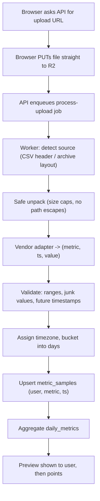

# Architecture

Both ingestion routes (file upload, provider API) end in the same common store, so points, badges and
leaderboards never change between routes. Phase 1 builds the upload route first.

## Upload route (phase 1)

## API route (phase 2)
Server-side OAuth only; tokens stored encrypted in `provider_connections`; a single sync worker
avoids Ultrahuman refresh-token rotation races; revoked access sets `needs_reconnect`.

## Rules to keep
- Never parse inside the upload request; the worker does it.
- Containers are ephemeral: treat uploads as temporary, delete raw files after parsing unless retention is chosen.
- Cross-device boards use only comparable metrics (`CROSS_DEVICE_METRICS`); HRV and proprietary scores stay per-device.
- Label data as verified (`api`) or self-reported (`upload`).
- Keep the app portable (plain Docker), and back up Postgres outside Railway.
