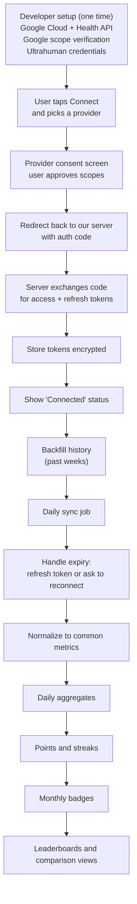
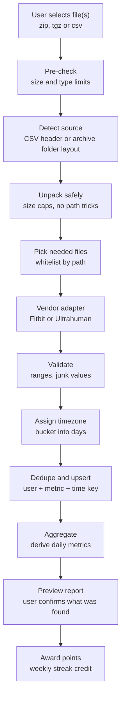

# Fitness Leaderboard App: Planning Summary

*Discussion summary, October 2026. Research findings reflect what I found at the time and should be re-verified before you build on them.*

---

## 1. Project overview

A web application where users upload their fitness tracker export data (or connect their tracker), and the app:

- Summarises everything in an organised, user-friendly way with interactive charts and graphs
- Groups reports by category (sleep, steps, calories, cardio, and so on)
- Processes exports from different trackers in the same unified way
- **Phase 1 headline feature:** leaderboards for every parameter, plus comparison between users, with a points-based gamification layer

## 2. Decisions so far

| Topic | Decision |
|---|---|
| Supported trackers (phase 1) | **Google Fitbit Air** and **Ultrahuman Ring** only (Whoop and Oura dropped for now) |
| Stack | React (frontend), Node.js (backend), PostgreSQL (data) |
| Hosting | Railway |
| Upload cadence | Weekly uploads with streaks and points |
| Gamification | Weekly points, monthly badges, bonus for 3 consecutive monthly wins (details still tentative, see section 6) |
| File storage | Free options only |
| Current stage | Moving from discussion to a basic first build |

---

## 3. Research: how to get data from each tracker

### Google Fitbit Air (Google Health)

- The Fitbit app is now **Google Health**. Takeout still labels the category "Fitbit".
- **File export:** a Takeout archive, **.zip or .tgz**, containing many small files by data type and date. The native export also offers CSV or JSON.
- **API:** the **Google Health API** (`health.googleapis.com/v4/`) replaces the legacy Fitbit Web API. It uses Google OAuth 2.0, and apps are registered in the Google Cloud console.
- Public apps need **restricted-scope verification**, a security review that takes time. Until verified, expect to test with a small list of users.
- The legacy **Fitbit Web API is being shut down** (deadline reported as extended to October 30, 2026), so a new app should target Google Health only.

### Ultrahuman Ring

- I found **no documented self-service full-export file**. The help centre mentions a Vision Dashboard for accessing and downloading ring data, but I couldn't confirm its format or history depth.
- **Partner API:** OAuth 2.0 with `profile`, `ring_data` and `cgm_data` scopes. Users authorise sharing in the app (Profile, Settings, Partner ID).
- Exposes sleep, HRV, resting heart rate, skin temperature, SpO2, movement and recovery indexes, and VO2 max.
- **Not self-serve:** you apply to the developer programme. **Refresh tokens rotate on every use**, so each new token must be saved atomically.
- Community tools mention an unofficial key-based route via support; treat it as unsupported.

### Whoop and Oura (dropped from phase 1, kept for reference)

- Whoop: CSV export (workouts, sleeps, physiological cycles, journal entries); no steps in the export as of early 2026; data is organised by physiological cycle, not calendar day.
- Oura: CSV via the Membership Hub, which can take up to 10 days; durations in seconds.

### Aggregator options

Open Wearables (open source, self-hosted, supports Google Health and Ultrahuman) and Terra (paid) can sit in front of the vendor APIs. You still obtain Ultrahuman credentials yourself.

---

## 4. Analysis of the sample ring export (`ring_data_2026_21.csv`)

The sample is a **raw sensor log, not a summary export**.

| Property | Finding |
|---|---|
| Shape | 3 columns (`timestamp_epoch`, `data_type`, `value`), long format, 3,065 rows |
| Time span | About 35 hours; timestamps are UTC epoch seconds |
| Sampling | One reading roughly every 6 minutes (440 timestamps) |
| Size | About 78 KB, so roughly 1.5 to 2 MB per month |
| Missing | No sleep stages, sleep sessions, calories, workouts, daily scores, device ID, user ID or timezone |

| `data_type` | What it looks like |
|---|---|
| `raw_hr` | 51 to 135, mean about 82; looks like bpm |
| `raw_hrv_2` | 0 to 255, median about 79; units unclear, possibly encoded or clipped |
| `raw_motion` | 0 to 150; the value 150 appears 144 times, so possibly a cap |
| `steps` | 0 to 237, mostly zeros; looks like per-interval counts |
| `temp` | 26.8 to 36.3; probably skin temperature in °C |
| `respiratory_rate` | 431 of 440 readings are 1, the rest are 240; looks like placeholders |
| `spo2` | 438 of 440 readings are 0; almost no real readings |

**Implications**

- Sleep duration, resting HR and consistency would have to be **derived by your own logic**, and results may not match what users see in the Ultrahuman app. This is the riskiest part of the upload route.
- Calories are absent, and cardio is limited by the 6-minute resolution.
- Respiratory rate and SpO2 look unusable in this sample.
- The format is easy to parse and detect, and `(timestamp, data_type)` works as a natural dedupe key.
- This is a single sample, so it's unknown whether a real full export looks the same.

---

## 5. Cross-device comparability

- **Proprietary scores can't be compared** across brands (recovery, readiness and similar). Compute neutral metrics from raw data instead.
- **Safest metrics for cross-device boards:** steps, sleep duration, sleep consistency, resting heart rate, active minutes, workout count.
- **HRV is risky:** calculation method and units differ by vendor and the ring's scale is unclear. Don't rank it across devices until verified.
- Device-specific metrics (Fitbit's Cardio Load, Ultrahuman's glucose and recovery-style scores) belong on per-device boards only.
- Sensor accuracy differs between a ring and a wrist band, so fairness is partly a design choice.

---

## 6. Leaderboards and gamification

### Core problems to solve

1. **Trust:** uploaded files can be edited, so raw leaderboards are easy to game. API connections give verified data. Consider "verified vs self-reported" labels and anomaly checks.
2. **Fairness:** raw totals favour the young and already fit. Use age/sex bands, percentiles, improvement-based points and consistency boards.
3. **Scope:** start with **private groups** (friends, office, gym) rather than a global board.

### Your tentative points design

- Weekly upload with a streak
- Points for reports each week
- A monthly badge each month, with points
- Three consecutive monthly badges earn a bonus (originally 25% of friends' points)

**Concern with the 25% steal:** it's a rich-get-richer mechanic. Friends lose points they earned, which breeds resentment and quitting. A safer alternative is a **system-funded multiplier** plus a permanent **"Champion" title**.

### Motivations beyond money

- **Status and identity:** permanent titles, badges, hall of fame, shareable recap cards
- **Social stakes:** rivalries, head-to-head duels, team challenges, reactions
- **Power:** the winner picks next week's challenge or holds a captain role
- **Progression:** levels, XP, streaks, unlockable themes and deeper analytics
- **Seasons:** resets every 4 to 8 weeks so late joiners stay in the game

### Design cautions

- Everyone needs something to play for, so use divisions with promotion and relegation, multiple boards, and personal bests.
- Cap daily points and weight consistency over raw totals to resist gaming.
- In a health app, avoid rewarding extremes (overtraining, under-sleeping, streaks while ill). Allow rest days.
- Award points only for metrics both devices measure comparably.

---

## 7. Ingestion: API route vs file-upload route

Both routes end in the same common store of daily metrics, feeding points, badges and leaderboards.

### 7a. API integration flow

Key notes:

- Token exchange and storage happen **server-side only**.
- Ultrahuman rotates refresh tokens on every use; use a database lock or a single sync worker to avoid races.
- Make syncs idempotent with a `(user, metric, timestamp)` key.
- If access is revoked, mark the user "needs reconnect" and don't award streak credit for missing data.
- On disconnect, revoke tokens at the provider and offer data deletion.
- Under sync, the "weekly upload streak" becomes "data synced for at least N days that week".

### 7b. File upload and parsing flow

Key notes:

- **Unpack safely:** cap uncompressed size and file count, reject paths that escape the target folder, never trust file extensions, and handle multi-part archives.
- **Vendor adapters** all output one record shape: `(metric, timestamp, value)`. The Fitbit adapter walks many small files; the Ultrahuman adapter reads one long CSV.
- **Validate:** drop or flag junk values such as the 240s and zeros seen in the sample, and reject future timestamps.
- **Preview before points:** show something like "found 6 days of steps, no sleep data" and let the user confirm.
- Keep the raw file only until processing finishes, unless you deliberately retain it (section 9).
- **Weekly upload concern:** as far as I know, Takeout exports can't be limited to the last week, so a weekly upload may mean re-uploading the whole history each time. Worth verifying.
- Parse in a background worker, not inside the upload request.

### 7c. Comparison

| | API route | Upload route |
|---|---|---|
| Data trust | Verified | Unverified (files can be edited) |
| User effort | Connect once | Upload every week |
| Data richness | Daily summaries (sleep, HRV, recovery) | Fitbit: many files; Ultrahuman sample: raw signals only |
| Approvals needed | Google verification, Ultrahuman partner access | None |
| Your workload | OAuth, token handling, sync jobs | Archive handling, parsing, derived metrics |

**Practical plan:** build the common store and points engine first, ship uploads for a small friends group, then add API connectors as approvals come through. The leaderboard logic never changes between routes.

---

## 8. Hosting on Railway

A natural layout is separate services in one project: web/API, a background worker, a cron service, Postgres, and an optional queue (for example Redis).

Things to design around:

1. **Request time limits:** Railway enforces a request deadline, so never parse files inside the upload request. Accept, return immediately, process in a worker.
2. **Storage:** container disks don't persist across deploys unless you attach a volume. Treat uploads as temporary.
3. **Cron behaviour:** cron is native on paid plans (one report says no cron on the free/trial plan; verify current plan details). The default restart policy retries failed jobs, so make jobs fail gracefully and respect provider rate limits.
4. **Token refresh races:** use a lock or a single sync worker for Ultrahuman token refresh.
5. **Reliability:** Railway has published several major postmortems between November 2025 and May 2026, including an outage of roughly eight hours on May 19, 2026. Take automated Postgres backups to somewhere outside Railway and keep the app portable (plain Docker, no Railway-only features).
6. **Cost:** usage-based. Parsing is bursty and cheap; daily sync is steady. Set a usage alert early.

---

## 9. File storage (free options only)

**For a basic version you may not need to store raw files at all:** upload, parse in a worker, save results in Postgres, delete the raw file. Keep raw files only if you want to re-parse later or debug bad uploads.

| Option | Free allowance | Notes |
|---|---|---|
| **Cloudflare R2** (recommended) | 10 GB storage, 1M writes and 10M reads per month, zero egress fees | S3-compatible, works with the standard AWS SDK from Node. Check at signup whether it asks for a payment card. |
| Backblaze B2 | First 10 GB free | Free egress up to 3x stored data, then $0.01/GB |
| Tigris | 5 GB, 10K writes and 100K reads per month, zero egress fees | Smaller limits |
| Supabase Storage | 1 GB storage, 5 GB bandwidth per month, **50 MB max upload** | The upload cap could block large Fitbit archives |

**Recommended pattern: direct upload.** The API issues a short-lived upload link, the browser sends the file straight to R2, and a worker downloads and parses it. Large archives never pass through your server, which avoids Railway's request limits.

---

## 10. Privacy and legal

- This is health data. Use explicit consent, opt-in sharing per metric on leaderboards, pseudonyms, easy deletion, and a clear retention policy.
- India's **DPDP Act** applies, and GDPR or US state laws apply if you have users elsewhere. Have someone qualified review this before launch.
- Check which Railway regions are available and where data would live; Google's verification review and the DPDP Act will likely ask about data location and security.
- Privacy-first option: parse in the browser and upload only aggregates. This is a strong selling point but weakens verification.

---

## 11. Build plan (basic first version)

1. **Backend core:** accounts and login, Postgres tables, upload and job queue
2. **Ultrahuman parser** and the common metrics table (a real sample exists)
3. **Points engine and leaderboards:** weekly points, streaks, monthly badge
4. **React frontend:** login, upload page with progress, dashboard charts, leaderboards
5. **Fitbit adapter:** write against a real archive rather than guessing its layout

---

## 12. Open questions and next steps

- **Fitbit archive layout:** share just the folder and file names inside a real Google Health Takeout archive (no contents) so the adapter can be written properly.
- **Ultrahuman export:** check what your Ultrahuman app actually lets you download (Vision Dashboard, settings and data sections). Confirm whether the CSV you shared is a slice of a longer export or the whole thing.
- **Target audience:** friends group, corporate wellness, or public community? This shapes cheating risk, privacy and scale.
- **Weekly upload feasibility:** verify whether Takeout can export only recent data.
- **Points formula:** define weekly point values, streak rules, and the final 3-month-winner reward.
- **Apply early** for Google restricted-scope verification and Ultrahuman partner access, since both take time.
- **Decide** whether to keep raw uploads at all or delete after parsing.
